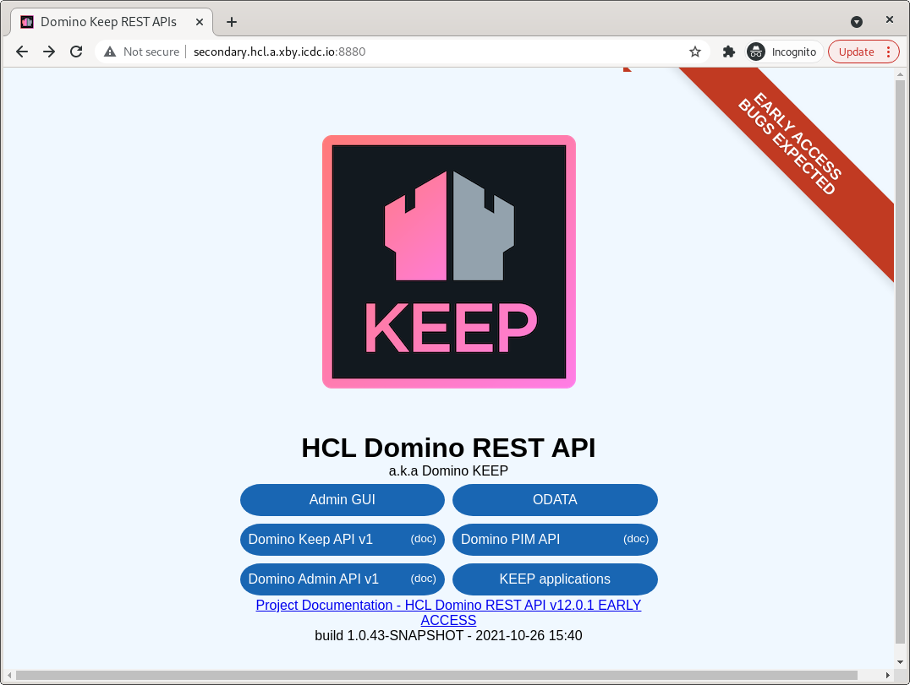

## Description of architecture

TBA

## Architecture diagram

TBA

## Id distribution

Initial password for all users: `IBA#2021Minsk`

### User ID's prime.hcl.a.xby.icdc.io

| ID            | Owner                 | Secondary Server ID |
| ------------- |:---------------------:| --------------|
|	Dev User1	| Jesse Gallagher       |	Secondary1	|
|	Dev User2	|		                |	Secondary2	|
|	Dev User3	| Alexander Medvedev    |	Secondary3	|
|	Dev User4	|           		    |	Secondary4	|
|	Dev User5	| Sergey Kosik	        |	Secondary5	|
|	Dev User6	|		                |	Secondary6	|
|	Dev User7	|               		|	Secondary7	|
|	Dev User8	|               		|	Secondary8	|
|	Dev User9	|		                |	Secondary9	|
|	Dev User10	| Dzmitry Sakovich   	|	Secondary10	|
|	Dev User11	| Pavel Lihtarovich     |	Secondary11	|
|	Dev User12	|           	    	|	Secondary12	|
|	Dev User13	|           	    	|	Secondary13	|
|	Dev User14	|           	    	|	Secondary14	|
|	Dev User15	|           	    	|	Secondary15	|
|	Dev User16	|           	    	|	Secondary16	|
|	Dev User17	|           	    	|	Secondary17	|
|	Dev User18	|           	    	|	Secondary18	|
|	Dev User19	|           	    	|	Secondary19	|
|	Dev User20	|           	    	|	Secondary20	|
|	Dev User21	|           	    	|	Secondary21	|
|	Dev User22	|           	    	|	Secondary22	|
|	Dev User23	|           	    	|	Secondary23	|
|	Dev User24	|           	    	|	Secondary24	|
|	Dev User25	|           	    	|	Secondary25	|
|	Dev User26	|           	    	|	Secondary26	|
|	Dev User27	|           	    	|	Secondary27	|
|	Dev User28	|           	    	|	Secondary28	|
|	Dev User29	|           	    	|	Secondary29	|
|	Dev User30	|           	    	|	Secondary30	|
|	Dev User31	|           	    	|	Secondary31	|
|	Dev User32	|           	    	|	Secondary32	|
|	Dev User33	|           	    	|	Secondary33	|
|	Dev User34	|           	    	|	Secondary34	|
|	Dev User35	|           	    	|	Secondary35	|
|	Dev User36	|           	    	|	Secondary36	|
|	Dev User37	|           	    	|	Secondary37	|
|	Dev User38	|           	    	|	Secondary38	|
|	Dev User39	|           	    	|	Secondary39	|
|	Dev User40	|           	    	|	Secondary40	|


### User ID's small-river.hcl.a.xby.icdc.io

| ID            | Owner                |
| ------------- |:--------------------:|
| Dev User1     | Katsiaryna Vasilyeva |
| Dev User2     | Vitaly Khoruzhko     |
| Dev User3     | Vitaly Levin         | 
| Dev User4     |                      |
| Dev User5     | Kiryl Staver         |
| Dev User6     | Vadzim Lindo         |
| Dev User7     |                      |
| Dev User8     |                      | 
| Dev User9     | Ivan Machuk          |

## Domino local secondary server set-up

### Auto setup

[Auto setup script and description for Windows](infrastructure/secondary_local_auto/Windows)

- Сlone this repository
```
git clone git@code.xby.icdc.io:hcl/quattro/hcl-keep-setup.git
cd ./hcl-keep-setup/infrastructure/secondary_local_auto/Linux_MacOS
chmod +x *.sh
```
- To init and start the container, run:
`sudo ./init_and_start.sh ID_NUM`

Replace `ID_NUM` with the required `server.id` number. 
`ID_NUM` ranges from 1 to 19.
- To remove the container, run:
`sudo ./down_rm.sh` (volume will be removed)
- To remove the container, run:
`sudo ./down.sh` (volume will be saved)
- To stop the container, run:
`sudo ./stop.sh`
- To start the container, run:
`sudo ./start.sh`


[Auto setup script and description for Linux and MacOS](infrastructure/secondary_local_auto/Linux_MacOS)

- Сlone this repository
```
git clone git@code.xby.icdc.io:hcl/quattro/hcl-keep-setup.git
cd hcl-keep-setup\infrastructure\secondary_local_auto/Windows
```
- To init and start the container, run:
`init_and_start.bat ID_NUM`

Replace `ID_NUM` with the required `server.id` number. 
`ID_NUM` ranges from 1 to 19.
- To remove the container, run:
`down_rm.bat` (volume will be removed)
- To remove the container, run:
`down.bat` (volume will be saved)
- To stop the container, run:
`stop.bat`
- To start the container, run:
`start.bat`

### Manual setup

[Manual setup(If auto setup is done, this step is not required)](infrastructure/README.md#manual-setup)


### Verifying the Installation

#### Domino

secondary.hcl.a.xby.icdc.io/names.nsf


#### Keep

secondary.hcl.a.xby.icdc.io:8880



secondary.hcl.a.xby.icdc.io:8880/openapi/index.html?url=/api/v1/schema/openapi.core.json#/authentication/authLogin


secondary.hcl.a.xby.icdc.io:8880/openapi/index.html?url=/api/v1/schema/openapi.core.json#/admin/fetchNsfList


